# Choco - Design Website

[Click for live website demo](https://bencheee.github.io/choco-design/)

This website is part of my 1st milestone project in [Code Institute's](https://codeinstitute.net/) Full Stack Software Development Course. This is website for imaginary company called 'Choco-Design'. This company is making unique chocolate products and selling them to other businesses such as hotels, bars, restaurants, shops, etc. Website is made to be fully responsive on range of devices to provide great browsing experience for existining partners and potential new customers.


## User Experience (UX)

### User stories

#### 1. First Time Visitor Goals

* As a First Time Visitor, I want to easily understand the main purpose of the site and what is company's main objective.
* As a First Time Visitor, I want to be able to easily navigate throughout the site to find content.
* As a First Time Visitor, I want to find out more about the products which are for sale.
* As a First Time Visitor, I want to find out more about the company and also I want to locate their social media links to see their followings and to determine how trusted and known they are.

#### 2. Returning Visitor Goals

* As a Returning Visitor, I want to find photo gallery with all products offered by company.
* As a Returning Visitor, I want to find the best way to get in contact with the the company with any enquiries I may have.

#### 3. Frequent User Goals

* As a Frequent User, I want to sign up to the Newsletter so that I am emailed any major updates and/or changes to the website or organisation.


## Wireframes

* [Mobile view](documentation/wireframes/wireframes-mobile.pdf)
* [Tablet view](documentation/wireframes/wireframes-tablet.pdf)
* [Desktop view](documentation/wireframes/wireframes-desktop.pdf)


## Design

### Colour Scheme

The two main colours used are dark chocolate brown (#2b1e18) and creamy beige (#ffdcbb).

### Imagery

The large, banner images are showing different types of chocolate products with colors matching site's colour scheme. Purpose of images is to give clear idea of the purpose of the site and to also make it visually attractive.

### Typography

The 'Thasadith' font is the main font used throughout the whole website with 'Sans Serif' as the fallback font in case for any reason the font isn't being imported into the site correctly. On some of the headings there is combination of 'Commissioner' and 'Euphoria Script' fonts with 'Sans Serif' as the fallback font.


## Features

* Responsive on all device sizes
* Interactive elements


## Technologies Used

### Languages Used

* [HTML5](https://en.wikipedia.org/wiki/HTML5)
* [CSS3](https://en.wikipedia.org/wiki/CSS) 

### Frameworks, Libraries & Programs Used

* [Gitpod](https://www.gitpod.io/)

Gitpod was used to write all the HTML and CSS code for the website.

* [Git](https://git-scm.com/)

Git was used for version control by utilizing the Gitpod terminal to commit to Git and Push to GitHub.

* [GitHub](https://github.com/)

GitHub is used to store the projects code after being pushed from Git.

* [Hatchful](https://hatchful.shopify.com/)

Hatchful is free online logo generator which was used to create logo for the company which is used on the website.

* [Balsamiq](https://balsamiq.com/)

Balsamiq was used to create the wireframes during the design process.

* [Photopea](https://www.photopea.com/)

Photopea is free online photo editor which was used to resize and optimize logo and photos for the website.

* [Font Awesome](https://fontawesome.com/)

Font Awesome was used on all pages throughout the website to add icons for aesthetic and UX purposes.

* [Google Fonts](https://fonts.google.com/)

Google fonts were used to import the 'Thasadith', 'Commissioner' and 'Euphoria Script' fonts into the style.css file which is used on all pages throughout the project.

* [Autoprefixer](https://autoprefixer.github.io/)

Autoprefixer was used to add prefixes to CSS properties which are not supported by some browsers.


## Testing

The [W3C Markup Validator](https://validator.w3.org/) and [W3C CSS Validator](https://jigsaw.w3.org/css-validator/) Services were used to validate every page of the project to ensure there were no syntax errors in the project.

* HTML Code Test
  [index.html](documentation/tests/w3c_index.JPG)
  [gallery.html](documentation/tests/w3c_gallery.JPG)
  [contact.html](documentation/tests/w3c_contact.JPG)
* CSS Code Test
  [CSS](documentation/tests/w3c_css.JPG)

### Testing User Stories from User Experience (UX) Section

#### 1. First Time Visitor Goals

* As a First Time Visitor, I want to easily understand the main purpose of the site and what is company's main objective.
  * On every page of the website there is a big banner with chocolate photo and company logo which clearly suggests the theme of the website.
  * On the left side of the banner there is a welcoming title with brief marketing text which tells main purpose of website and purpose of every page. *(On mobile and tablet version title section is above banner)*
  * Below banner on the main page there is main content area which contains more details on types of business that owner of the company identified as key partners.

* As a First Time Visitor, I want to be able to easily navigate throughout the site to find content.
  * The site has been designed to be responsive on mobile, tablet and desktop sizes. At the top of each page there is a clean navigation bar. Each link clearly describes to which page user will be redirected.
  * Layout of the website is consistent with navigation bar, banner section, content section and footer on every page.
  * At the bottom of every page there is a link to bring the user back to the top of the page.
  * On gallery page in desktop view there are thumbnail images that act as links to each gallery podsection.
  * At the end of each gallery podsection in desktop view there is a link which brings user back to the main gallery menu.

* As a First Time Visitor, I want to find out more about the products which are for sale.
  * On main gallery page products are organized in categories with clear text description for every podsection.
  * In desktop view user has the option to click on image thumbnails to access the gallery with more images of the same product type.
  * In mobile and tablet views there are no thumbnail links, and in mobile version there are only two photos per each section.

* As a First Time Visitor, I want to find out more about the company and also I want to locate their social media links to see their followings and to determine how trusted and known they are.
  * 'Contact' page of the website provides the user with all relevant information about the company and it's owner Betty Miller in 'About Us' section.
  * In the footer area throughout the website there are icons linking to company's profiles on various social media accounts. Links are opening in new tabs with intention of keeping user on our website after checking social media sites.

#### 2. Returning Visitor Goals

* As a Returning Visitor, I want to find photo updated gallery with all products offered by company.
  * Gallery section has 'new' badge feature added to photos to clearly show which products are newest in company's portfolio.

* As a Returning Visitor, I want to find the best way to get in contact with the the company with any enquiries I may have.
  * On every page in the website there is a call to action button which invites the user to enquire about products. Click on this button will redirect the user directly to contact form.
  * On the navigation bar  throughout the website there is a link to 'Contact' page. There user can fill out the provided form and send the message directly to the company email. Alternatively user can contact the company via one of the social media links provided in the footer.
  * The footer contains links to the company's Facebook, Instagram, Pinterest and Youtube profiles as well as the email link. Each link will be opened in new tab to ensure that user can easily get back to the website. Email link will open default email app and autofill email address in to recepient field.

#### 3. Frequent User Goals

* As a Frequent User, I want to sign up to the Newsletter so that I am emailed any major updates and/or changes to the website or organisation.
  * On 'Contact' page there is a link which asks user to sign up to the newsletter.

### Further Testing

* Lighthouse test results

  Desktop (index.html; gallery.html; contact.html)

  <a href="documentation/tests/lh_desktop_index.JPG">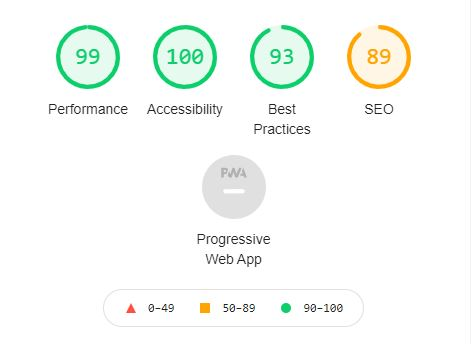</a>
  <a href="documentation/tests/lh_desktop_gallery.JPG">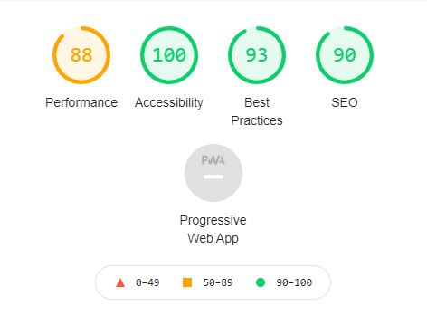</a>
  <a href="documentation/tests/lh_desktop_contact.JPG">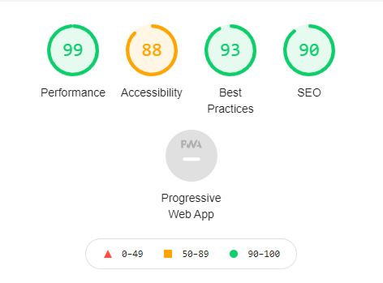</a>

  Mobile (index.html; gallery.html; contact.html)

  <a href="documentation/tests/lh_mobile_index.JPG">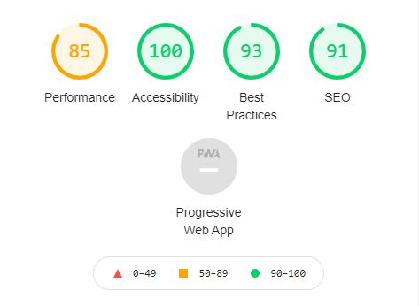</a>
  <a href="documentation/tests/lh_mobile_gallery.JPG">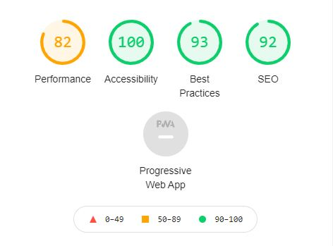</a>
  <a href="documentation/tests/lh_mobile_contact.JPG">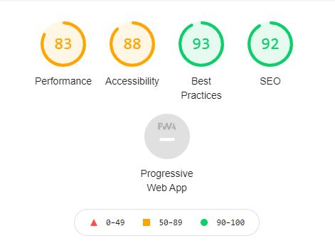</a>

* The website was tested on Google Chrome, Internet Explorer, Microsoft Edge, Mozilla Firefox and Opera browser.

  <div style="text-align: center; display: inline-block;"><a href="documentation/tests/browser_chrome.JPG">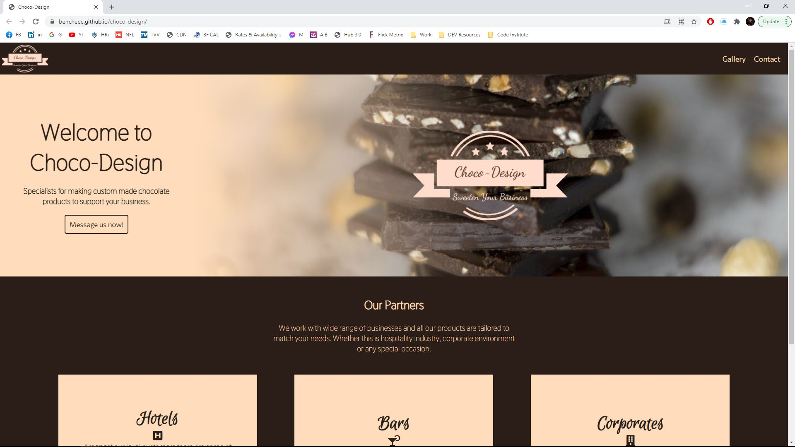</a>
  <p>Chrome</p>
  </div>
  <div style="text-align: center; display: inline-block;"><a href="documentation/tests/browser_ie.JPG">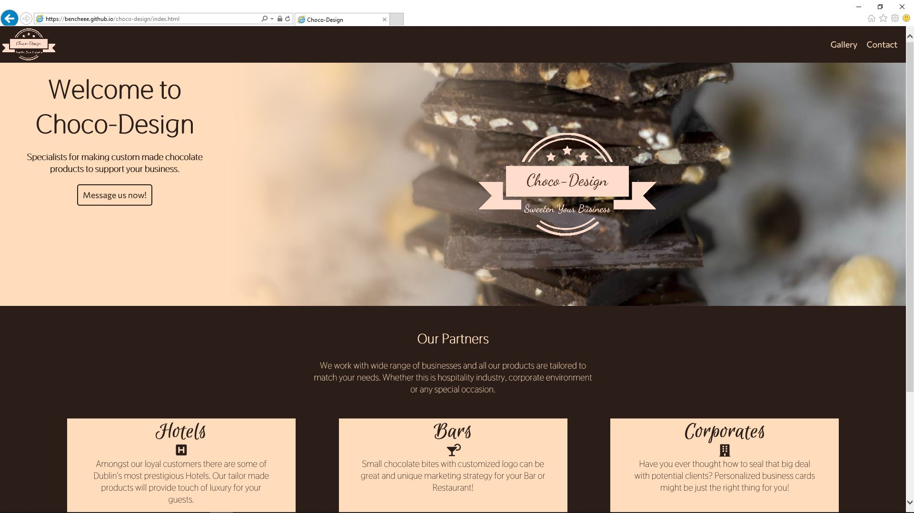</a>
  <p>IE</p>
  </div>
  <div style="text-align: center; display: inline-block;"><a href="documentation/tests/browser_edge.JPG">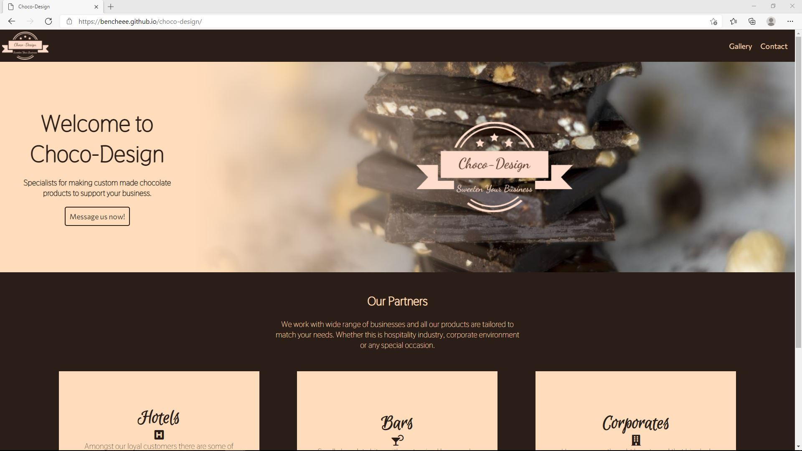</a>
  <p>Edge</p>
  </div>
  <div style="text-align: center; display: inline-block;"><a href="documentation/tests/browser_firefox.JPG">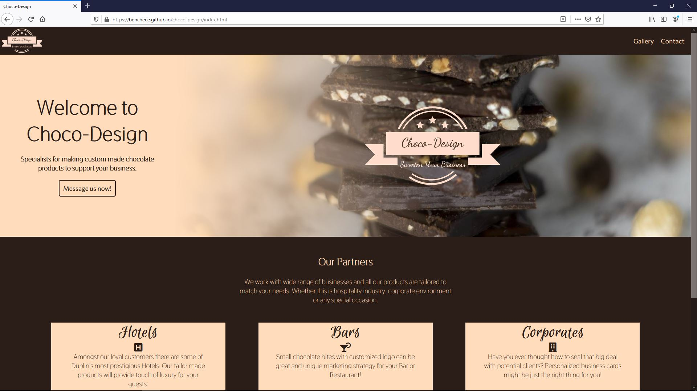</a>
  <p>Firefox</p>
  </div>
  <div style="text-align: center; display: inline-block;"><a href="documentation/tests/browser_opera.JPG">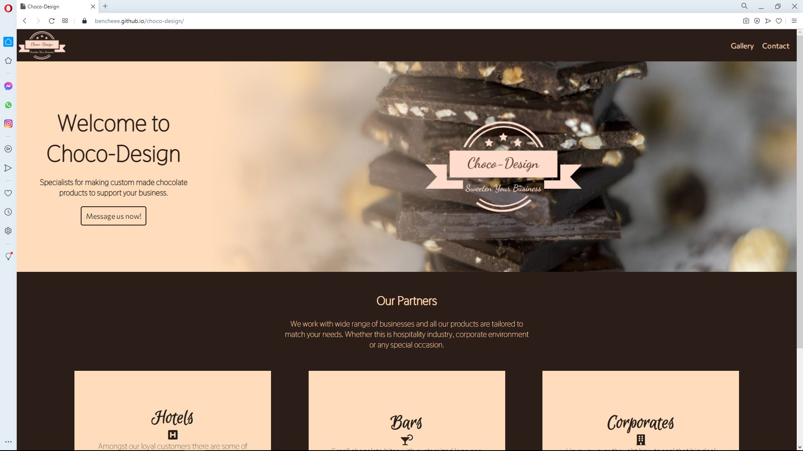</a>
  <p>Opera</p>
  </div>

* The website was viewed on a variety of devices such as iPhone7, iPhone XR, Samsung Galaxy S10+ and Huawei Media Pad T3.

  iPhone 7

  <a href="documentation/tests/iphone7_01.JPG">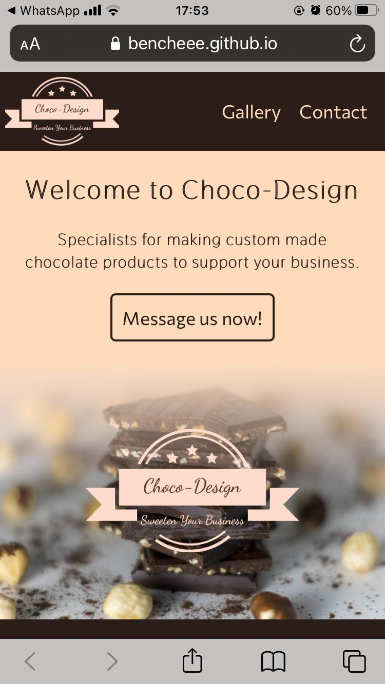</a>
  <a href="documentation/tests/iphone7_02.JPG">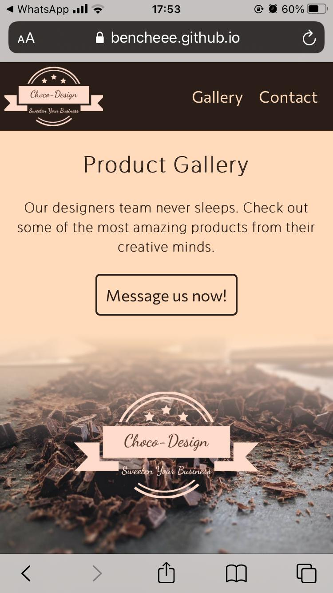</a>
  <a href="documentation/tests/iphone7_03.JPG">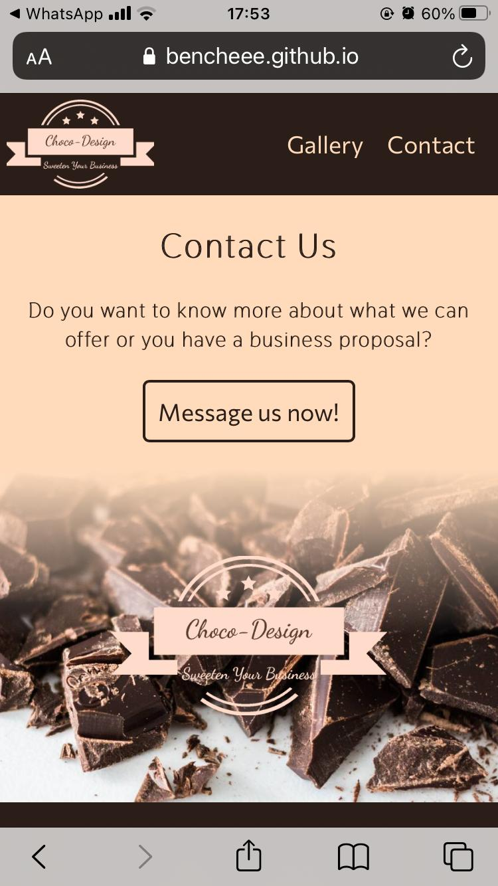</a>

  iPhone XR

  <a href="documentation/tests/iphonexr_01.jpg">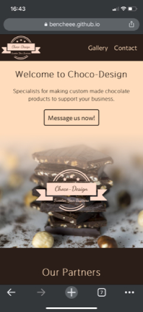</a>
  <a href="documentation/tests/iphonexr_02.jpg">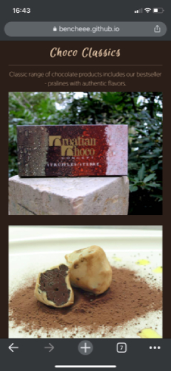</a>
  <a href="documentation/tests/iphonexr_03.jpg">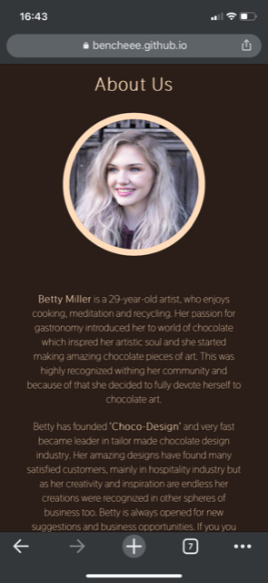</a>

  Samsung Galaxy S10+

  <a href="documentation/tests/samsungs10_01.JPG">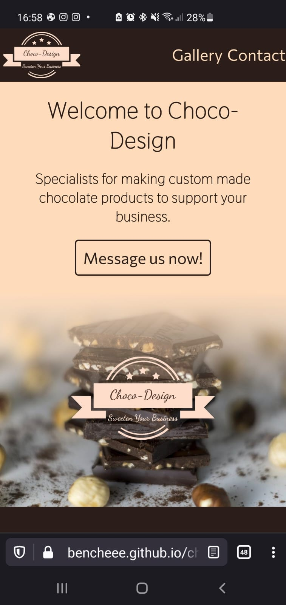</a>
  <a href="documentation/tests/samsungs10_02.JPG">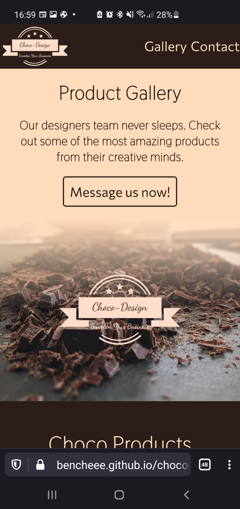</a>
  <a href="documentation/tests/samsungs10_03.JPG">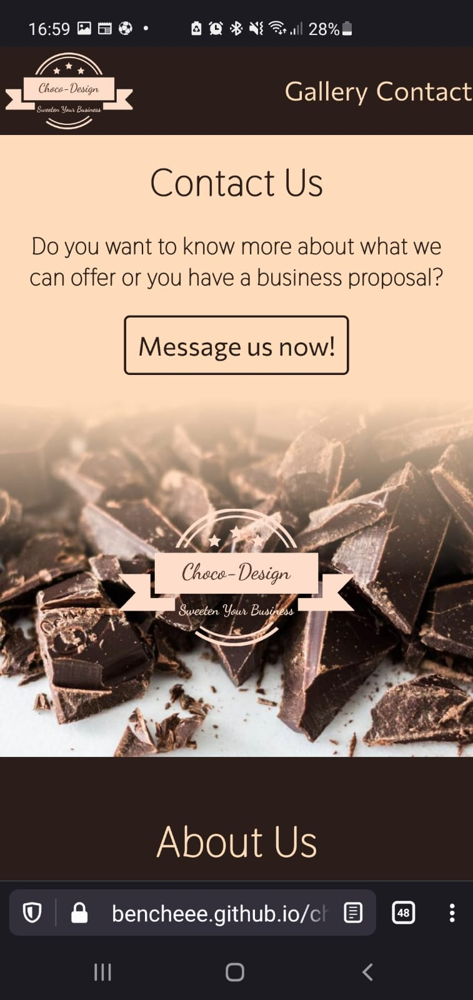</a>

  Huawei Media Pad T3

  <a href="documentation/tests/huaweit3_01.jpg">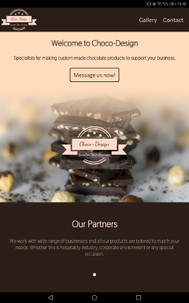</a>
  <a href="documentation/tests/huaweit3_02.jpg">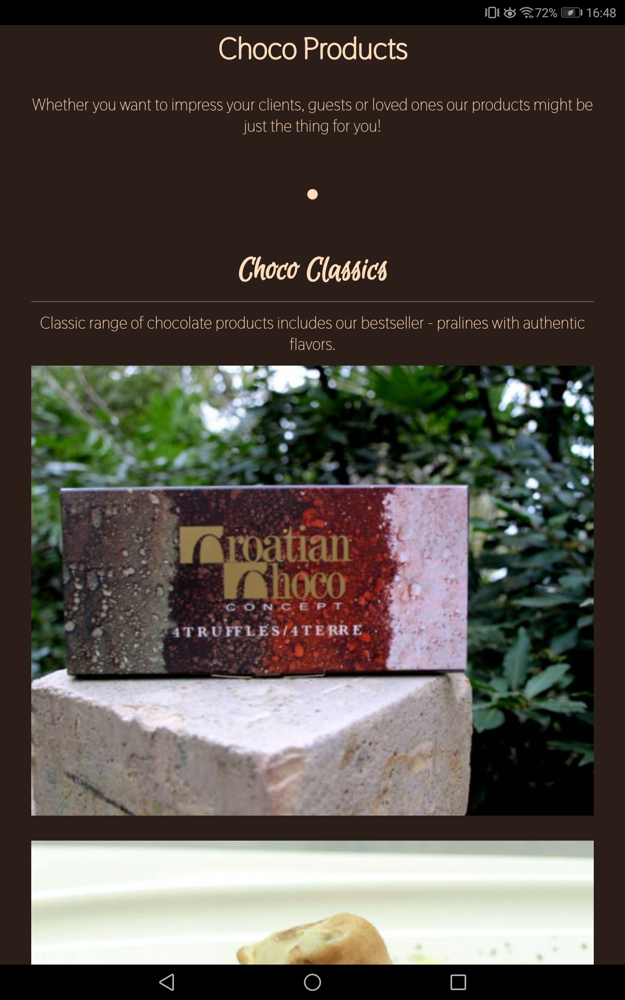</a>
  <a href="documentation/tests/huaweit3_03.jpg">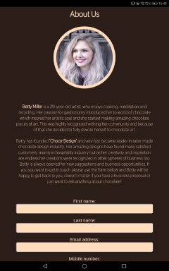</a>

* The website was tested on desktop and laptop computers on a variety of screen sizes using device toolbar option in Google Chrome developer tools.

  

* A large amount of testing was done to ensure that all pages were linking correctly.

#### Known Bugs

* Internet Explorer v1607
  - content boxes on index.html not centered
  - horizontal rules not showing
* Mozilla Firefox v85.0.2
  - content boxes on index.html not centered
* Samsung Galaxy S10+
  - content of the page is a bit wider probably due to curved edges of the screen
* links to submit the contact form and to sign up for newsletter do not have any functionality yet

#### Previous bugs (fixed)

* Content boxes on the main page in desktop view are not centered properly.
  * This was caused by following CSS code:

  ```CSS
    .content p:last-of-type {
        margin-top: 50px;  
    }
  ```


## Deployment

### GitHub Pages

The project was deployed to GitHub Pages using the following steps:

1. Log in to GitHub and locate the GitHub Repository
2. At the top of the Repository (not top of page), locate the "Settings" Button on the menu.
3. Scroll down the Settings page until you locate the "GitHub Pages" Section.
4. Under "Source", click the dropdown called "None" and select "Master Branch".
5. The page will automatically refresh.
6. Scroll back down through the page to locate the now published site link in the "GitHub Pages" section.

### Forking the GitHub Repository

By forking the GitHub Repository we make a copy of the original repository on our GitHub account to view and/or make changes without affecting the original repository by using the following steps:

1. Log in to GitHub and locate the GitHub Repository
2. At the top of the Repository (not top of page) just above the "Settings" Button on the menu, locate the "Fork" Button.
3. You should now have a copy of the original repository in your GitHub account.

### Making a Local Clone

1. Log in to GitHub and locate the GitHub Repository
2. Under the repository name, click "Clone or download".
3. To clone the repository using HTTPS, under "Clone with HTTPS", copy the link.
4. Open Git Bash
5. Change the current working directory to the location where you want the cloned directory to be made.
6. Type git clone, and then paste the URL you copied in Step 3.
```
$ git clone https://github.com/YOUR-USERNAME/YOUR-REPOSITORY
```
7. Press Enter. Your local clone will be created.
```
$ git clone https://github.com/YOUR-USERNAME/YOUR-REPOSITORY
> Cloning into `CI-Clone`...
> remote: Counting objects: 10, done.
> remote: Compressing objects: 100% (8/8), done.
> remove: Total 10 (delta 1), reused 10 (delta 1)
> Unpacking objects: 100% (10/10), done.
```


## Credits

### Media 

* All banner images and image of random woman which was used for Betty Miller's profile photo are licence free and downloaded from [Unsplash](https://unsplash.com/)
* Photos used in gallery section are property of Marina Prijatelj and were used with author's permission. Photos are downloaded from website [cokolada.hr](http://www.cokolada.hr/)

### Content

* All content was written by Sandro Bencinic (developer).
* Betty Miller's character is fictional and was made up by developer.

### Readme

* Code Institute's readme file template was used to create readme file for this website. Content of original readme file was modified by developer to match properties of this website.

### Acknowledgements

* My mentor Aaron Sinnott for continuous helpful feedback.
* Tutor support at Code Institute for their support.